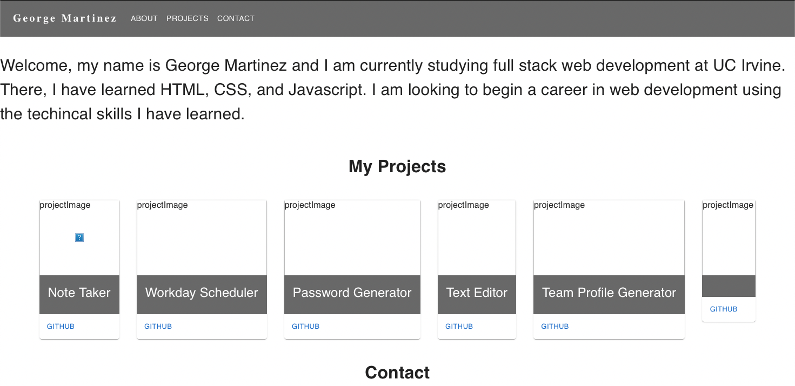

# George's Portfolio
 
## Sample

## Table of Contents
* [Description](#description)
* [Deployement](#deployment)
* [Installation](#installation)
* [Packages](#table-of-contents)
* [License](#license)
* [Contributing](#contributing)
* [Questions](#questions)
    
## [Description](#table-of-contents)
  
  A portfolio generated using React.
  Showcases a quick intro about me, my completed projects, and a way to leave a message.

## [Deployment](#deployment)
[GitHub Pages]()

## [Installation](#table-of-contents)

## [Packages](#table-of-contents)
-React
-mui

## [License](#table-of-contents)
  
## [Contributing](#table-of-contents)

## [Questions](#table-of-contents)